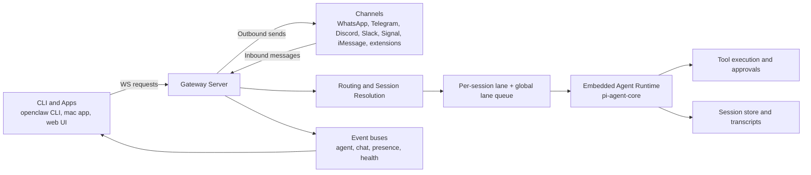

# Core Architecture

Last updated: 2026-03-15

This page is the system level map for OpenClaw. It explains the runtime boundaries, how requests and messages flow, and where each responsibility lives in code.

For wire level details of the WebSocket protocol, see [Gateway protocol](/gateway/protocol).
For gateway host and networking semantics, see [Gateway architecture](/concepts/architecture) and [Network model](/gateway/network-model).

## System map

## Runtime boundaries

- `src/index.ts` initializes runtime guards and starts the CLI program.
- `src/cli/program/build-program.ts` builds the command tree and program context.
- `src/gateway/server.impl.ts` is the gateway orchestrator that wires config, channels, plugin runtime, websocket handling, and background services.
- `src/gateway/server-ws-runtime.ts` and `src/gateway/server/ws-connection.ts` attach connection lifecycle and handshake logic.
- `src/gateway/server-methods.ts` dispatches typed gateway methods with role and scope checks.
- `src/auto-reply/*` and `src/agents/pi-embedded-runner/*` execute agent runs and streaming.
- `src/routing/*` maps inbound messages to `(agentId, sessionKey)` deterministically.
- `src/plugins/*` and `src/channels/plugins/*` load extension capabilities and channel plugins.

## Flow A control plane request

Use this mental model for `agent`, `send`, `chat.send`, `channels.status`, and most control operations.

1. Client opens WebSocket to gateway.
2. Gateway emits `connect.challenge` nonce and expects first request frame to be `connect`.
3. After auth and pairing checks, the connection is registered with role and scopes.
4. Request frames are validated and dispatched by method name.
5. Method handler executes against shared gateway context (channels, node registry, dedupe caches, runtime state).
6. Response frame returns immediately for request completion.
7. Long running operations also emit follow up `event` frames (`agent`, `chat`, `presence`, `health`, `cron`).

Core files:

- `src/gateway/server/ws-connection/message-handler.ts`
- `src/gateway/server-methods.ts`
- `src/gateway/server-methods-list.ts`

## Flow B inbound channel message to agent reply

This is the dominant runtime path for WhatsApp, Telegram, Discord, Slack, and other channels.

1. Channel plugin receives inbound event and builds `MsgContext`.
2. Routing resolves target agent and session key using bindings and chat metadata.
3. Auto-reply dispatcher enforces dedupe, queue mode, send policy, and hook triggers.
4. `runEmbeddedPiAgent` runs inside a per-session lane and a global lane.
5. Embedded runtime streams lifecycle, tool, and assistant events.
6. Reply dispatcher normalizes payloads and sends tool/block/final outputs.
7. Outbound channel delivery writes response and mirrors transcript/session state.

Core files:

- `src/auto-reply/reply/dispatch-from-config.ts`
- `src/agents/pi-embedded-runner/run.ts`
- `src/auto-reply/reply/reply-dispatcher.ts`
- `src/infra/outbound/*`

Related docs:

- [Agent loop](/concepts/agent-loop)
- [Command queue](/concepts/queue)
- [Sessions](/concepts/session)

## Routing and session model

Routing chooses one agent and one session deterministically per inbound message.

- Bindings are matched from most specific to least specific (peer, parent peer, guild plus roles, guild, team, account, channel, default).
- Session keys are normalized under `agent:<agentId>:...` to isolate per-agent transcripts and run lanes.
- Direct messages can collapse to main or be split depending on configured DM scope.
- Per-session serialization guarantees one active embedded run per session key.

Core files:

- `src/routing/resolve-route.ts`
- `src/routing/session-key.ts`
- `src/routing/bindings.ts`

Related docs:

- [Multi agent routing](/concepts/multi-agent)

## Concurrency model

OpenClaw uses in-process lane queues, not external worker infrastructure.

- Session lane: `session:<sessionKey>` keeps a single active run for each session.
- Global lane: caps total parallel runs (`main` by default, with dedicated lanes like `cron` and `subagent`).
- Queue modes (`collect`, `steer`, `followup`, `steer-backlog`) decide how additional inbound messages interact with an active run.

Core files:

- `src/process/command-queue.ts`
- `src/agents/pi-embedded-runner/lanes.ts`
- `src/auto-reply/reply/queue.ts`

## Plugin and channel architecture

OpenClaw treats channels as plugins with a shared lifecycle contract.

- Plugin discovery and manifest validation live in `src/plugins/loader.ts`.
- Runtime SDK surface for plugins is provided by `src/plugins/runtime/index.ts`.
- Channel plugin registry and ordering are in `src/channels/plugins/index.ts` and `src/channels/registry.ts`.
- Gateway channel lifecycle (start, stop, restart backoff, runtime snapshots) is managed by `src/gateway/server-channels.ts`.

Related docs:

- [Plugin system](/tools/plugin)
- [Multi-agent sandbox tools](/tools/multi-agent-sandbox-tools)

## Event model

The gateway is event driven internally and externally.

- Internal buses:
  - agent events: `src/infra/agent-events.ts`
  - system events: `src/infra/system-events.ts`
- External websocket events include `agent`, `chat`, `presence`, `health`, `heartbeat`, `cron`, and pairing events.
- Chat streaming and delta buffering are coordinated in `src/gateway/server-chat.ts`.

## Security boundaries

OpenClaw enforces security at multiple layers.

- Handshake and device trust: challenge signed connect flow with role-aware pairing and token validation.
- Method authorization: role and scope checks per method before handler execution.
- Runtime controls: sandbox policy, tool approval policy, and elevated execution policy are independent controls.

Core files:

- `src/gateway/server/ws-connection/message-handler.ts`
- `src/gateway/server-methods.ts`

Related docs:

- [Gateway security](/gateway/security)
- [Sandbox vs tool policy vs elevated](/gateway/sandbox-vs-tool-policy-vs-elevated)

## Where to change what

- Add or modify a gateway RPC method: `src/gateway/server-methods/*.ts` and `src/gateway/server-methods-list.ts`
- Change inbound routing behavior: `src/routing/resolve-route.ts`
- Change session key shape: `src/routing/session-key.ts`
- Change queueing and concurrency: `src/process/command-queue.ts` and `src/agents/pi-embedded-runner/lanes.ts`
- Change embedded run lifecycle or failover: `src/agents/pi-embedded-runner/run.ts`
- Change reply shaping and delivery behavior: `src/auto-reply/reply/*` and `src/infra/outbound/*`
- Add a channel: `extensions/<channel>/` plus channel plugin registration surfaces
- Change plugin loader or runtime capabilities: `src/plugins/loader.ts` and `src/plugins/runtime/*`

## Architecture maintenance checklist

When changing core architecture, verify these invariants:

- Connect handshake still requires `connect` as the first request.
- Agent runs remain serialized per session key.
- Side effect methods (`agent`, `send`) preserve idempotency behavior.
- Routing remains deterministic for the same `(channel, account, peer)` input.
- Channel plugin lifecycle still supports start, stop, and restart with runtime status.
- Event streams still include lifecycle end semantics for `agent.wait` reliability.
